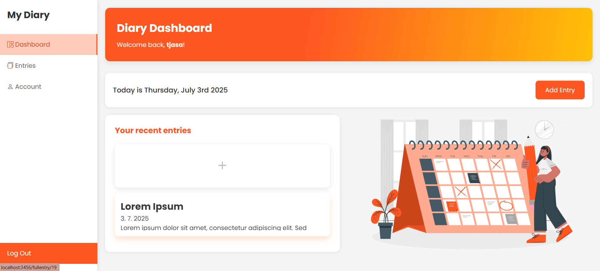
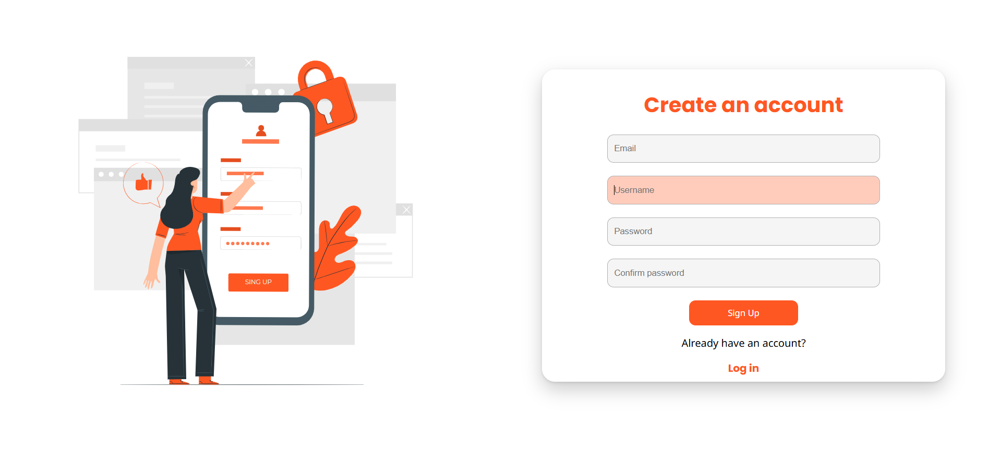

# Diary App 📖
My Diary App lets users securely write, view, and manage daily journal entries. After logging in, users see their recent entries and can add new ones by choosing a title, date, and content. Entries are saved by date and can be viewed or deleted anytime. The app includes confirmation prompts to prevent accidental changes, making it a simple and safe way to keep a personal journal.

### File Set-Up
I used pretty much the same set-up as in my 'Memory Game' project - I started by installing the necessary Node.js modules: Express, express-session, nodemon, bcrypt, mysql2, EJS, and dotenv. I used EJS as the templating engine and placed all my .ejs files in "views" folder. Static files like CSS and JavaScript are served from the "public" folder. 

### The Database
I created my database in MySQL Workbench. It has two tables: *User* and *Entry*.
The *User* table stores people's email, username, password (crypted), the date when they created their account and the date when they last logged in.
The *Entry* table stores the entry's title, date and content, and is connected to the *User* table via a foreign key.

### Styling
I went with a clean, modern, and simple look. I’m not a pro designer, but I did my best that the interface works well for the app and used a bit of AI to help me get a good layout.
The color palette is from *Material Palette* (https://www.materialpalette.com), the illustrations are from *StorySet* (https://storyset.com/people) , and the icons are from *Bootstrap Icons* (https://icons.getbootstrap.com/)  
For the layout, I initially wrote entire HTML structures for every page, using the same code over and over again - until I remembered there's a more efficient way to do it. Though it took me some time to fix the mess, I ended up creating the main layout, without writing the same code too many times. To achieve this, I used the *express-ejs-layout* module, allowing me to have the main layout in a single *main.ejs* file, in which I included the *navbar.ejs* file and the other files as the 'main content'.

### User authentification
The user authentification was not my primary goal for this project, so I kept it simple. The email and the username must be unique, but the email is not verified (I only used the 'email' input type).

### The app logic
Upon logging in, users are greeted with a personalized dashboard displaying a welcome message, today’s date, and their three most recent diary entries.
Clicking the "Add Entry" button takes them to a form where they can:
- Enter a custom title or select from a list of prompt suggestions
- Choose a date for the entry (defaults to today if left empty)
- Write the content of their entry
    
After submitting, the user is redirected to a page showing all their entries. Each entry can be clicked to view its full content, and users have the option to delete any entry. Before submitting or deleting, a confirmation modal ensures the user truly wants to proceed.
 
#### So how does it work?
Each page has its own .ejs file, which is served to the user via a GET route, which manages page rendering and data retrieval. They all fetch data from the database via a simple SELECT query, pass it to the .ejs file, which then displays it. They all first check if the user is logged in - if not, they are redirected to the login page.
The root route *(/)* serves the dashboard, showing the user’s three most recent entries along with a welcome message. The */entries* route lists all entries by the logged-in user, ordered by date. For viewing a specific entry in full, the */fullentry/:id* route fetches the entry by its ID, ensuring it belongs to the user before rendering it.   

The */newentry* route displays the form to add a new entry, while the /account route fetches and shows the user’s account details like email, username, and usage dates. Each route checks for a valid user session to secure the content and redirects to login if the user is not authenticated.

Data manipulation is handled through the POST routes. The /newentry route accepts form data to insert a new entry into the database, including the user ID, title, content, and date. If the user does not specify a date, the current date is automatically assigned. The route also validates that the content is not empty before saving. The /delete-entry route allows users to delete an entry by its ID, ensuring the entry belongs to the logged-in user. Once deleted, this action cannot be undone. Both routes handle errors gracefully and redirect the user appropriately upon success or failure.

### Possible improvements
- [ ] Responsive design
- [ ] Filtering entries (e.g. by date)
- [ ] A functional calendar
